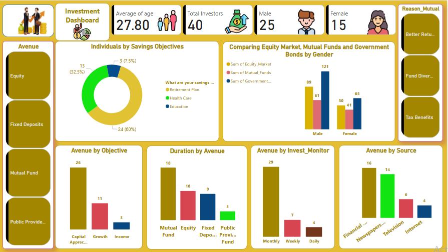

# 💼 Investment Insights Dashboard – Power BI

> 📈 A data-driven Power BI project focused on analyzing investor behavior across various financial instruments, savings goals, and investment durations.

---

## 🧠 Project Summary

This dashboard provides actionable insights into:

- 🎯 **Investor Objectives** – Retirement, Healthcare, Education
- 👨‍👩‍👧‍👦 **Demographics** – Age, Gender Distribution
- 📊 **Investment Instruments** – Mutual Funds, Equity, Fixed Deposits, PPF
- 🕒 **Investment Duration & Frequency**
- 📚 **Sources of Financial Decision Making**
- 🧠 **Key Insights** – Gender gaps, Preferences, Risk appetite

---

## 📷 Dashboard Previews

### 🟡 Main Dashboard Overview

---

## ✅ Key Analytical Tasks

### 📌 Task 1: Data Exploration & Summary
- Average Age: **27.80**
- Total Investors: **40**
- Investment Avenues: **37**
- Gender Split: **25 Male**, **15 Female**
- Objective Breakdown: Majority aim for **Retirement Plans**.

---

### 📌 Task 2: Gender-Based Investment Analysis
- Males dominate **Equity** investments (risk-takers).
- Women invest more in **Mutual Funds**, indicating a preference for safer instruments.
- **Government Bonds** are the most preferred overall.

---

### 📌 Task 3: Objective-Based Investment Behavior
- Top Objective: **Capital Appreciation**
- Strong correlation between investment avenues and investor objectives.

---

### 📌 Task 4: Investment Duration & Monitoring Frequency
- **Mutual Funds** are held for the longest duration.
- Most investors monitor their investments **monthly**.

---

### 📌 Task 5: Reasons for Investment
- Key Reasons:  
  ✅ Better Returns  
  ✅ Fund Diversification  
  ✅ Tax Benefits

---

### 📌 Task 6: Source of Information
- Most trusted source: **Financial Consultants**
- Traditional media (Newspapers) still plays a significant role.

---

## 🛠 Tools & Technologies

| Tool          | Purpose                          |
|---------------|----------------------------------|
| Power BI      | Data Modeling & Visualization    |
| Excel         | Data Cleaning & Preparation      |
| GitHub        | Project Collaboration & Hosting  |

---

## 📁 Repository Structure
